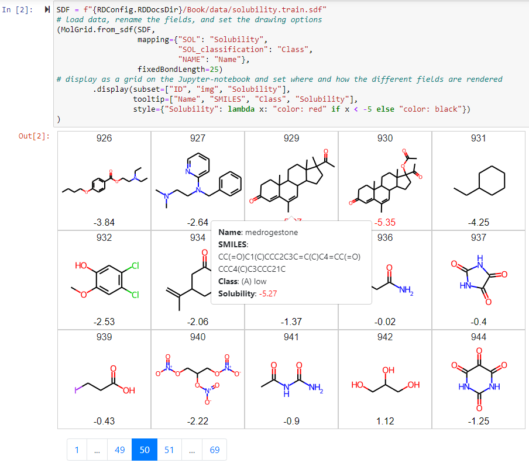

# molgrid

molgrid is a chemical viewer for 2D structures of small molecules



## Usage
---

You can setup the grid from a pandas DataFrame or an SDF file:

```python
from molgrid import MolGrid

# pandas, must contain a SMILES column
mg = MolGrid(df)

# SDF
mg = MolGrid.from_sdf("/path/to/molecules.sdf")
```

There are currently 2 templates available:
  * `pages`, the default, which is displayed above. It integrates nicely with notebooks
  * `table`, which displays the full list of molecules (no pages). Useful if you ever need to print the full list of molecules on paper (or print to PDF)


## License
---

Unless otherwise noted, all files in this directory and all subdirectories are distributed under the Apache License, Version 2.0:
```
    Copyright 2021 Cédric BOUYSSET

    Licensed under the Apache License, Version 2.0 (the "License");
    you may not use this file except in compliance with the License.
    You may obtain a copy of the License at

        http://www.apache.org/licenses/LICENSE-2.0

    Unless required by applicable law or agreed to in writing, software
    distributed under the License is distributed on an "AS IS" BASIS,
    WITHOUT WARRANTIES OR CONDITIONS OF ANY KIND, either express or implied.
    See the License for the specific language governing permissions and
    limitations under the License.
```