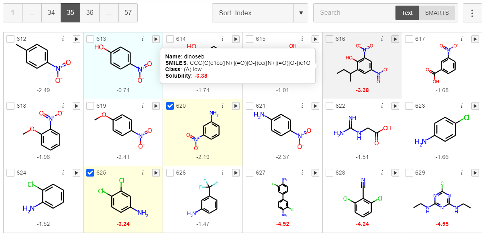

# 💡 Introduction

- [](https://pypi.python.org/pypi/mols2grid)
  [](https://anaconda.org/conda-forge/mols2grid)

- [](https://github.com/cbouy/mols2grid/actions/workflows/ci.yml)
  [](https://github.com/cbouy/mols2grid/actions/workflows/build.yml)
  [](https://mols2grid.readthedocs.io/en/latest/?badge=latest)
  [](https://codecov.io/gh/cbouy/mols2grid)

- [](https://www.rdkit.org/)
  [](https://hub.knime.com/cbouy/spaces/Public/latest/Interactive%20Grid%20of%20Molecules)

**mols2grid** is an interactive molecule viewer for 2D structures, based on RDKit.



# 🐍 Installation
---

mols2grid was developped for Python 3.7+ and requires rdkit (>=2020.03.1), pandas and jinja2 as dependencies.  
The easiest way to install it is from conda:
```shell
conda install -c conda-forge mols2grid
```

Alternatively, you can also use pip:
```shell
pip install rdkit mols2grid
```

If you notice that the selections, callbacks and interactive filtering aren't working as intended, you may have to manually activate the extension:
- for Jupyter Lab: `jupyter labextension install mols2grid`
- for Jupyter Notebook: `jupyter nbextension install mols2grid`

**Compatibility**

mols2grid is mainly meant to be used in notebooks (Jupyter notebooks, Jupyter Lab, and Google Colab) but it can also be used as a standalone HTML page opened with your favorite web browser, or embedded in a Streamlit app.

Since Streamlit doesn't seem to support ipywidgets yet, some features aren't functional: retrieving the selection from Python (you can still export it from the GUI) and using Python callbacks.


<p>You can also use mols2grid directly in <a href="https://www.knime.com/">KNIME</a>, by looking for the `Interactive Grid of Molecules` component on the Knime HUB.<br/>
Make sure you have setup <a href="https://docs.knime.com/latest/python_installation_guide">Knime's Python integration</a> for the node to work.</p>


# 📜 Usage
---

You can display a grid from:

- an SDFile

```python
import mols2grid

mols2grid.display("path/to/molecules.sdf")
```

- a `pandas.DataFrame`:

```python
mols2grid.display(df, smiles_col="Smiles")
```

- a list of RDKit molecules:

```python
mols2grid.display(mols)
```

Please head to the [notebooks](notebooks/quickstart.html) and [API reference](api/simple.html) sections for a complete overview of the features available.

# 🚀 Resources
---
* [Simple example](https://iwatobipen.wordpress.com/2021/06/13/draw-molecules-on-jupyter-notebook-rdkit-mols2grid/) by iwatobipen
* Creating a web app with Streamlit for filtering datasets:
  * [Blog post](https://blog.reverielabs.com/building-web-applications-from-python-scripts-with-streamlit/) by Justin Chavez
  * [Video tutorial](https://www.youtube.com/watch?v=0rqIwSeUImo) by Data Professor
* [Viewing clustered chemical structures](https://practicalcheminformatics.blogspot.com/2021/07/viewing-clustered-chemical-structures.html) and [Exploratory data analysis](https://practicalcheminformatics.blogspot.com/2021/10/exploratory-data-analysis-with.html) by Pat Walters
* [Advanced notebook (RDKit UGM 2021)](https://colab.research.google.com/github/rdkit/UGM_2021/blob/main/Notebooks/Bouysset_mols2grid.ipynb)

Feel free to open a pull request if you'd like your snippets to be added to this list!

# 👏 Acknowledgments
---
* [@themoenen](https://github.com/themoenen) (contributor)
* [@fredrikw](https://github.com/fredrikw) (contributor)
* [@JustinChavez](https://github.com/JustinChavez) (contributor)
* [@hadim](https://github.com/hadim) (conda feedstock maintainer)

# 🎓 Citing
---
You can refer to mols2grid in your research by using the following DOI:

[](https://zenodo.org/badge/latestdoi/348814588)

# ⚖ License
---

Unless otherwise noted, all files in this directory and all subdirectories are distributed under the Apache License, Version 2.0:
```text
    Copyright 2021-2022 Cédric BOUYSSET

    Licensed under the Apache License, Version 2.0 (the "License");
    you may not use this file except in compliance with the License.
    You may obtain a copy of the License at

        http://www.apache.org/licenses/LICENSE-2.0

    Unless required by applicable law or agreed to in writing, software
    distributed under the License is distributed on an "AS IS" BASIS,
    WITHOUT WARRANTIES OR CONDITIONS OF ANY KIND, either express or implied.
    See the License for the specific language governing permissions and
    limitations under the License.
```
